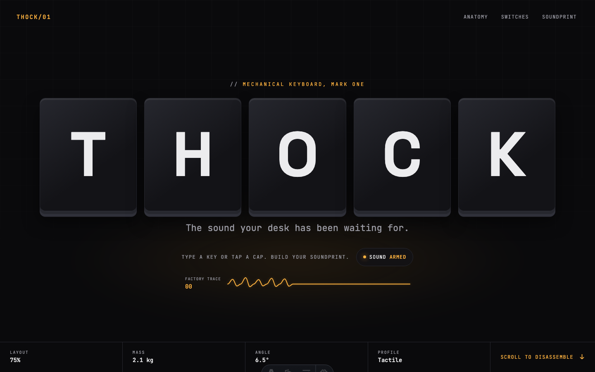

# THOCK/01

An interactive launch page for a fictional 75% mechanical keyboard, built for the [Webflow × GSAP Astro Challenge](https://codetv-gsap-cloud.webflow.io/).

THOCK/01 turns the product itself into the interface: keycaps land with weight, every press becomes a live acoustic force trace, the keyboard separates into five layers while scrolling, and three switch profiles generate their own sound in the browser.



## Experience

- **Build a soundprint** — type any key or tap the five hero caps to create a unique live force trace that follows you through the page.
- **Hear the profiles** — Tactile, Linear, and Clicky sounds are synthesized live with the Web Audio API. No audio files are loaded.
- **Disassemble the board** — a pinned scroll sequence pulls apart the keycaps, switch plate, PCB, dampener, and aluminum case.
- **Read the force curves** — DrawSVG reveals a different actuation curve for every switch profile.
- **Replay your signal** — the final control redraws and replays the visitor’s own pattern instead of submitting a fake product form.

## Built with

- [Astro](https://astro.build/) for a lightweight static build
- [GSAP](https://gsap.com/) with ScrollTrigger, DrawSVG, Physics2D, CustomEase, CustomBounce, and ScrambleText
- CSS 3D transforms for the exploded keyboard model
- Web Audio API for procedural switch sounds

The experience includes touch and keyboard input, visible focus states, a skip link, semantic headings, live interaction feedback, responsive layouts down to 320px, and a complete `prefers-reduced-motion` presentation.

## Run locally

```sh
npm ci
npm run dev
```

Open `http://localhost:4321`, then type, scroll, and audition the three switch profiles.

```sh
npm run check
npm run build
npm run preview
```

The production site is generated in `dist/`.

See the [competition brief](docs/competition-brief.md), [benchmark analysis](docs/benchmark-analysis.md), [QA log](docs/qa-log.md), and [submission package](docs/submission-package.md) for the complete decision and verification record.

## Structure

```text
src/
├── components/
│   ├── Progress/   # scroll progress signal
│   ├── Hero/       # keycap intro, touch/keyboard input, and sound control
│   ├── Anatomy/    # pinned exploded-view sequence
│   ├── Switches/   # force curves and sound-profile selector
│   ├── Soundprint/ # live visitor-generated force trace
│   └── Footer/     # soundprint replay and project credit
├── lib/
│   ├── gsap.js     # focused plugin registration
│   ├── sound.js    # procedural keyboard audio engine
│   └── soundprint.js # deterministic force-trace state and geometry
├── pages/index.astro
└── styles/global.css
```

## Deploy and submit

1. Push this project to a public GitHub repository.
2. Connect that repository to [Webflow Cloud](https://developers.webflow.com/webflow-cloud/bring-your-own-app).
3. Verify the live URL on desktop and mobile.
4. Submit the live URL, repository, and tech stack through the challenge form before the published deadline.

The experience sends or stores no personal data. Soundprints exist only in the current page session.
